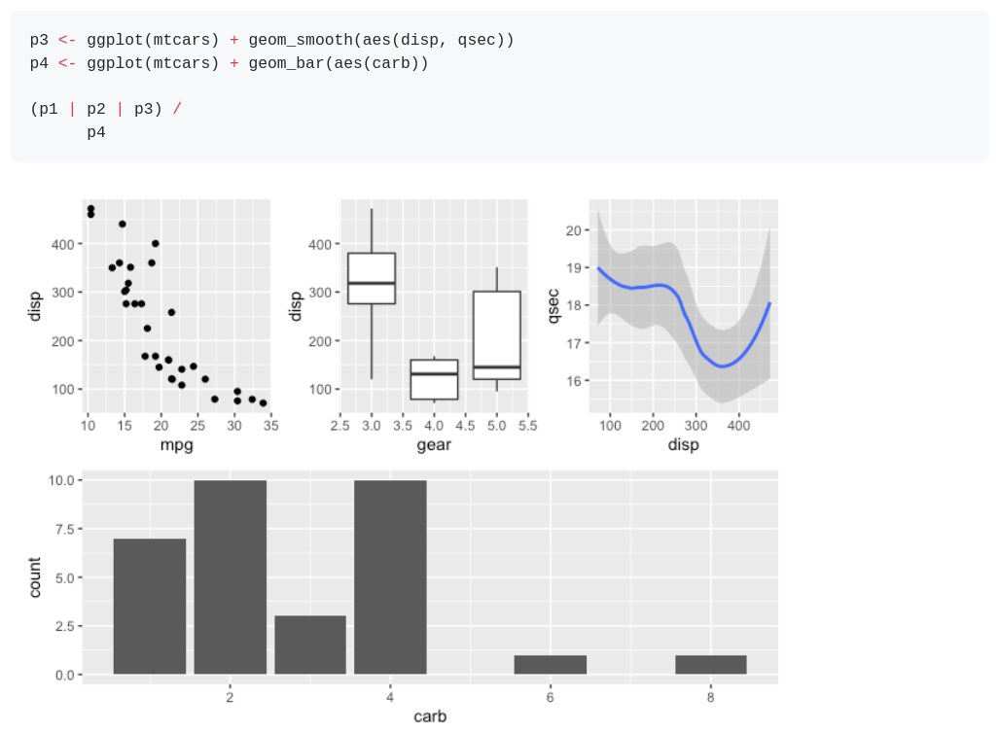
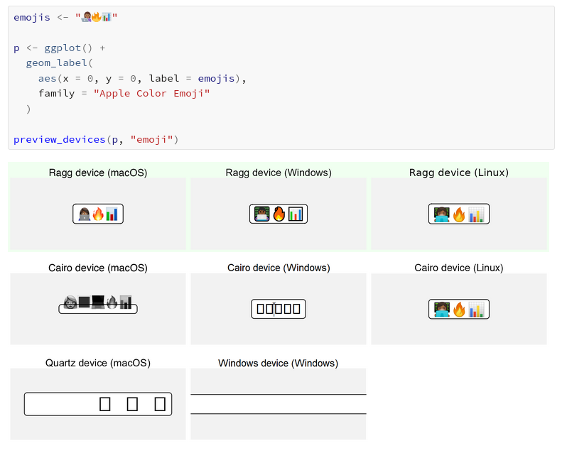

# ggplot

## third party packages 

### package {DataExplorer}

```r
devtools::install_github("boxuancui/DataExplorer")
```


https://boxuancui.github.io/DataExplorer/articles/dataexplorer-intro.html
### package `{patchwork}` : https://gotellilab.github.io/GotelliLabMeetingHacks/NickGotelli/ggplotPatchwork.html




### package `{sfnetworks}`: https://twitter.com/LuukvanderMeer/status/1371498267188592642


https://twitter.com/LuukvanderMeer/status/1371498267188592642

### color scales 

A complete guide to scales

There are numerous scales in ggplot2. Too many to memorize. This app makes it easy for you to find the right scales and arguments for your variable types and aesthetics. 

https://ggplot2tor.com/scales/

#### Modern Text Features in R {ragg}

https://www.tidyverse.org/blog/2021/02/modern-text-features/

- Support for non-Latin scripts including Right-to-Left (RtL) scripts
- Support for OpenType features such as ligatures, glyph substitutions, etc.
- Support for color fonts
- Support for font fallback




## Blogdown 

- https://alison.rbind.io/post/new-year-new-blogdown/


### Aesthetics 

fill aesthetic + pch = 21 + color = "white"

https://twitter.com/andrewheiss/status/1373013429150175234/photo/4
